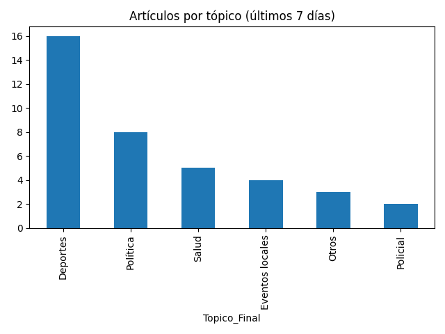

# Newsletter semanal (2025-06-26)

**Total de artículos (19 Jun – 26 Jun):** 31  

**Tópicos cubiertos:** 11

---

## 📊 Distribución por tópico

---

## 🔝 Tópicos más frecuentes

| Tópico | Notas | % Total | Vistas | Vistas/Nota |
|---|---:|---:|---:|---:|
| Deportes | 11 | 35% | 39 | 3.5 |
| Política | 5 | 16% | 5 | 1.0 |
| Internacional | 4 | 13% | 5 | 1.2 |
| Finanzas | 2 | 6% | 3 | 1.5 |
| Precios y costo de vida | 2 | 6% | 4 | 2.0 |
| Policial | 2 | 6% | 9 | 4.5 |
| Turismo y viajes | 1 | 3% | 2 | 2.0 |
| Eventos locales | 1 | 3% | 3 | 3.0 |

---

## ✨ Artículos destacados

### Este fin de semana el riesgo de incendios será muy alto en Córdoba
*20 Jun 2025 — 39 vistas*

### Sorpresa en el Mundial de Clubes 2025: histórico triunfo de Botafogo al PSG
*20 Jun 2025 — 20 vistas*

### Condenan a nueve personas por millonaria estafa inmobiliaria en Calamuchita
*26 Jun 2025 — 5 vistas*

### Después de 12 años vuelve el Rally Cordobés a Río Cuarto
*25 Jun 2025 — 4 vistas*

---

## 🔮 Recomendaciones

- Refuerzo en **Medio Ambiente**: alto interés con pocas notas (engagement: 39.0).
- Optimizar **Política**: bajo interés relativo pese a varias notas (engagement: 1.0).
- Buen rendimiento en **Deportes**: mantener estrategia (engagement: 3.5).

## ✍️ Autores de la semana

- Francis Dinatale
- Jose Manuel Ferrero