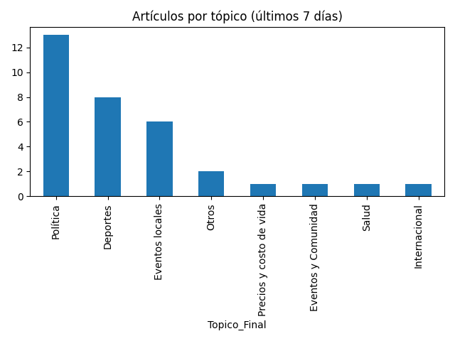

# Newsletter semanal (2025-06-27)

**Total de artículos (20 Jun – 27 Jun):** 27  

**Tópicos cubiertos:** 9

---

## 📈 Vistas fluctuantes por día

---

## 📊 Distribución por tópico

---

## 🔝 Tópicos más frecuentes

| Tópico | Notas | % Total | Vistas | Vistas/Nota |
|---|---:|---:|---:|---:|
| Deportes | 9 | 33% | 17 | 1.9 |
| Política | 5 | 19% | 5 | 1.0 |
| Internacional | 4 | 15% | 5 | 1.2 |
| Policial | 2 | 7% | 9 | 4.5 |
| Precios y costo de vida | 2 | 7% | 4 | 2.0 |
| Finanzas | 2 | 7% | 3 | 1.5 |
| Turismo y viajes | 1 | 4% | 2 | 2.0 |
| Eventos locales | 1 | 4% | 3 | 3.0 |

---

## ✨ Artículos destacados

### Condenan a nueve personas por millonaria estafa inmobiliaria en Calamuchita
*26 Jun 2025 — 5 vistas*

### Después de 12 años vuelve el Rally Cordobés a Río Cuarto
*25 Jun 2025 — 4 vistas*

### Aumento de combustibles: los 12 trucos para ahorrar hasta 40% de nafta y gasoil
*25 Jun 2025 — 4 vistas*

### Arrestan a un policía en Córdoba por integrar una red de estafas a través de Tinder
*26 Jun 2025 — 4 vistas*

---

## 🔮 Recomendaciones

- Refuerzo en **Policial**: alto interés con pocas notas (engagement: 4.5).
- Optimizar **Política**: bajo interés relativo pese a varias notas (engagement: 1.0).

## ✍️ Autores de la semana

- Francis Dinatale
- Jose Manuel Ferrero
## 📈 Vistas acumuladas por día

