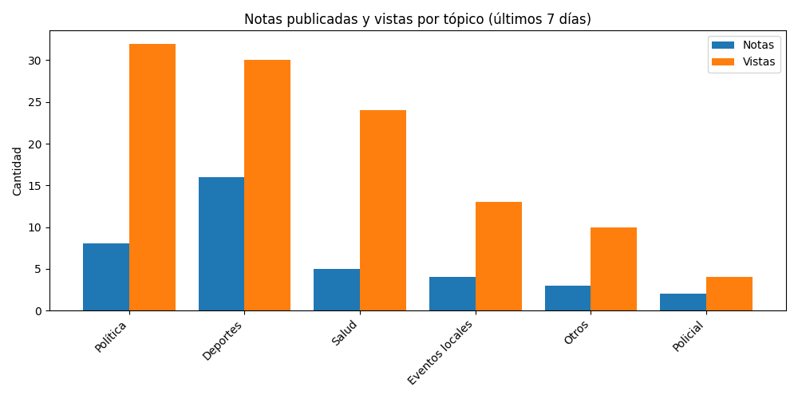

# Newsletter semanal (2025-06-30)

**Total de artículos (23 Jun – 30 Jun):** 39  

**Tópicos cubiertos:** 10

---

## 📈 Vistas fluctuantes por día

---

## 📑 Notas publicadas vs vistas por tópico

---

## 🗓️ Vistas por día y tópico

---

## 🔝 Tópicos más frecuentes

| Tópico | Notas | % Total | Vistas | Vistas/Nota |
|---|---:|---:|---:|---:|
| Deportes | 11 | 28% | 25 | 2.3 |
| Política | 8 | 21% | 16 | 2.0 |
| Policial | 5 | 13% | 23 | 4.6 |
| Internacional | 4 | 10% | 9 | 2.2 |
| Precios y costo de vida | 3 | 8% | 5 | 1.7 |
| Eventos locales | 3 | 8% | 7 | 2.3 |
| Finanzas | 2 | 5% | 3 | 1.5 |
| Clima | 1 | 3% | 2 | 2.0 |

---

## ✨ Artículos destacados

### La nieve copó La Cumbrecita: colapso vehicular y operativos de emergencia por la masiva llegada de turistas
*30 Jun 2025 — 6 vistas*

### Condenan a nueve personas por millonaria estafa inmobiliaria en Calamuchita
*26 Jun 2025 — 6 vistas*

### Arrestan a un policía en Córdoba por integrar una red de estafas a través de Tinder
*26 Jun 2025 — 4 vistas*

### Franco Colapinto terminó 16 en el Gran Premio de Austria 
*27 Jun 2025 — 4 vistas*

---

## 🔮 Recomendaciones

- Refuerzo en **Turismo y viajes**: alto interés con pocas notas (engagement: 3.0).
- Optimizar **Precios y costo de vida**: bajo interés relativo pese a varias notas (engagement: 1.7).
- Buen rendimiento en **Policial**: mantener estrategia (engagement: 4.6).

## ✍️ Autores de la semana

- Francis Dinatale
- Jose Manuel Ferrero