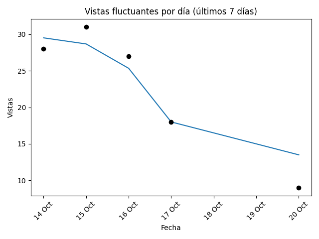

# Newsletter semanal (2025-07-28)

**Total de artículos (21 Jul – 28 Jul):** 43  

**Tópicos cubiertos:** 11

---

## 📈 Vistas fluctuantes por día

---

## 📑 Notas publicadas vs vistas por tópico

---

## 🗓️ Vistas por día y tópico

---

## 🔝 Tópicos más frecuentes

| Tópico | Notas | % Total | Vistas | Vistas/Nota |
|---|---:|---:|---:|---:|
| Política | 12 | 28% | 31 | 2.6 |
| Otros | 7 | 16% | 23 | 3.3 |
| Deportes | 5 | 12% | 10 | 2.0 |
| Policial | 5 | 12% | 41 | 8.2 |
| Eventos locales | 4 | 9% | 13 | 3.2 |
| Clima | 2 | 5% | 3 | 1.5 |
| Justicia | 2 | 5% | 7 | 3.5 |
| Cultura | 2 | 5% | 5 | 2.5 |

---

## ✨ Artículos destacados

### Violento asalto en Villa Yacanto: Ingresaron y en 2 horas amenazaron y violentaron a la hermana de un ex intendente
*24 Jul 2025 — 29 vistas*

### Piñón Fijo llega a Santa Rosa para celebrar el Día del Niño
*22 Jul 2025 — 5 vistas*

### Choque múltiple en Ruta 5: pareja en moto sufrió politraumatismos y fue hospitalizada
*22 Jul 2025 — 5 vistas*

### Milei llamó “bruta traidora” a Villarruel y prometió sorpresas “con los resultados de octubre”
*23 Jul 2025 — 5 vistas*

---

## 🔮 Recomendaciones

- Refuerzo en **Justicia**: alto interés con pocas notas (engagement: 3.5).
- Optimizar **Deportes**: bajo interés relativo pese a varias notas (engagement: 2.0).
- Buen rendimiento en **Policial**: mantener estrategia (engagement: 8.2).

## ✍️ Autores de la semana

- Francis Dinatale
- Jose Manuel Ferrero
- Redaccion