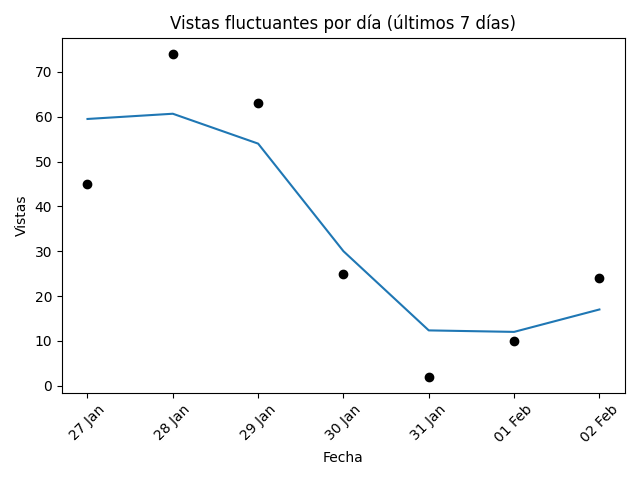
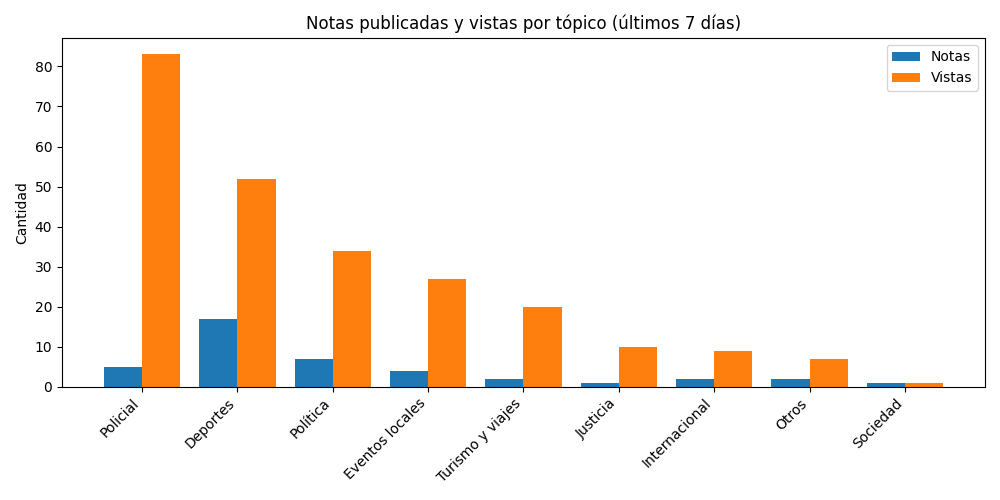
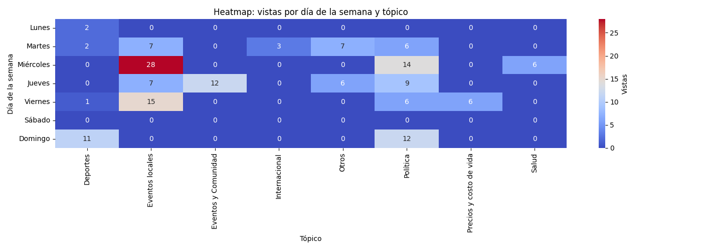

# Newsletter semanal (2025-09-08)

**Total de artículos (01 Sep – 08 Sep):** 37  

**Tópicos cubiertos:** 7

---

## 📈 Vistas fluctuantes por día

---

## 📑 Notas publicadas vs vistas por tópico

---

## 🗓️ Vistas por día y tópico

---

## 🔝 Tópicos más frecuentes

| Tópico | Notas | % Total | Vistas | Vistas/Nota |
|---|---:|---:|---:|---:|
| Deportes | 19 | 51% | 40 | 2.1 |
| Política | 11 | 30% | 31 | 2.8 |
| Eventos locales | 2 | 5% | 4 | 2.0 |
| Policial | 2 | 5% | 4 | 2.0 |
| Otros | 1 | 3% | 2 | 2.0 |
| Justicia | 1 | 3% | 4 | 4.0 |
| Clima | 1 | 3% | 4 | 4.0 |

---

## ✨ Artículos destacados

### La bronca de Scaloni por la fecha de la Finalissima entre la Selección Argentina y España: &#8220;Nos mató&#8221;
*02 Sep 2025 — 7 vistas*

### La Comisión Investigadora de $LIBRA cita a declarar a Karina Milei y otros funcionarios
*03 Sep 2025 — 5 vistas*

### Entre tibios aplausos, denunció una &#8220;operación de desprestigio&#8221; y un ataque hacia su hermana
*04 Sep 2025 — 4 vistas*

### Israel Damonte y su deseo por dirigir a Boca: “Es el club más grande de la Argentina”
*02 Sep 2025 — 4 vistas*

---

## 🔮 Recomendaciones

- Refuerzo en **Clima**: alto interés con pocas notas (engagement: 4.0).
- Optimizar **Deportes**: bajo interés relativo pese a varias notas (engagement: 2.1).
- Buen rendimiento en **Política**: mantener estrategia (engagement: 2.8).

## ✍️ Autores de la semana

- Francis Dinatale
- Jose Manuel Ferrero