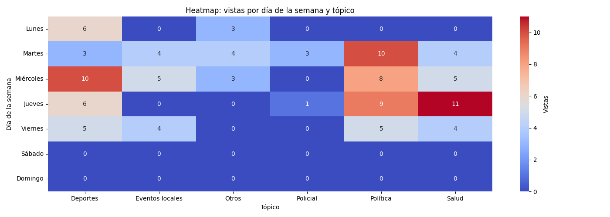

# Newsletter semanal (2026-01-05)

**Total de artículos (29 Dec – 05 Jan):** 41  

**Tópicos cubiertos:** 10

---

## 📈 Vistas fluctuantes por día

---

## 📑 Notas publicadas vs vistas por tópico

---

## 🗓️ Vistas por día y tópico

---

## 🔝 Tópicos más frecuentes

| Tópico | Notas | % Total | Vistas | Vistas/Nota |
|---|---:|---:|---:|---:|
| Internacional | 15 | 37% | 49 | 3.3 |
| Policial | 8 | 20% | 49 | 6.1 |
| Deportes | 5 | 12% | 23 | 4.6 |
| Política | 3 | 7% | 12 | 4.0 |
| Otros | 2 | 5% | 10 | 5.0 |
| Turismo y viajes | 2 | 5% | 13 | 6.5 |
| Clima | 2 | 5% | 7 | 3.5 |
| Precios y costo de vida | 2 | 5% | 7 | 3.5 |

---

## ✨ Artículos destacados

### Peligro en la Ruta 5: dos detenidos tras realizar maniobras temerarias y evadir un control
*30 Dec 2025 — 9 vistas*

### Al menos 40 personas murieron en el ataque de Estados Unidos a Venezuela
*04 Jan 2026 — 8 vistas*

### Tragedia en La Cumbrecita: un turista cordobés murió ahogado en el sector de La Cascada
*30 Dec 2025 — 8 vistas*

### Córdoba proyecta un verano récord: más de 500 mil turistas eligieron la provincia para iniciar el 2026
*05 Jan 2026 — 8 vistas*

---

## 🔮 Recomendaciones

- Refuerzo en **Eventos locales**: alto interés con pocas notas (engagement: 7.0).
- Optimizar **Internacional**: bajo interés relativo pese a varias notas (engagement: 3.3).
- Buen rendimiento en **Policial**: mantener estrategia (engagement: 6.1).

## ✍️ Autores de la semana

- Francis Dinatale
- Jose Manuel Ferrero