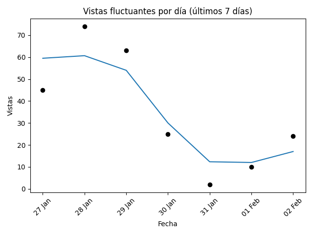
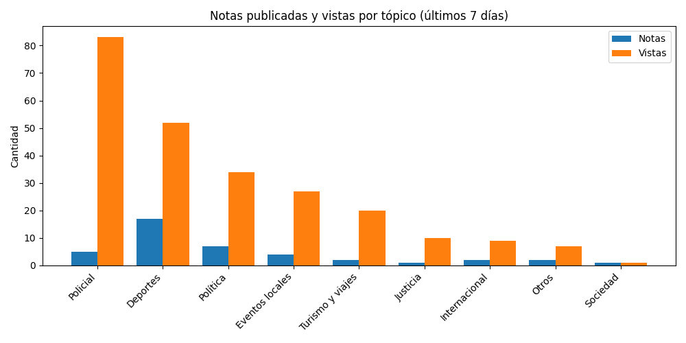
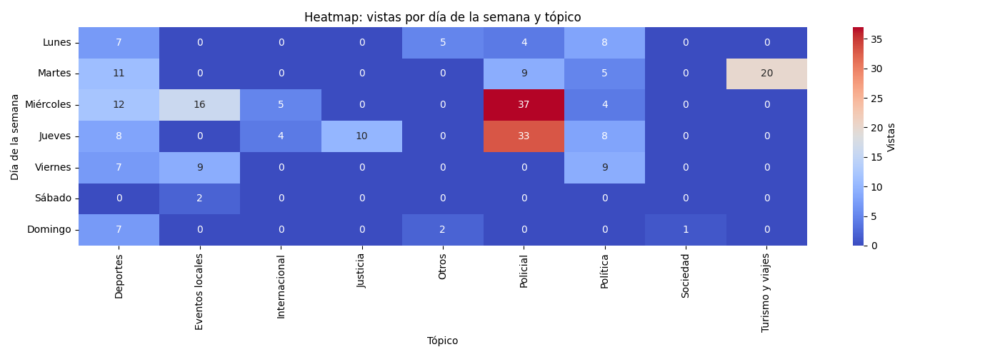

# Newsletter semanal (2026-02-02)

**Total de artículos (26 Jan – 02 Feb):** 41  

**Tópicos cubiertos:** 9

---

## 📈 Vistas fluctuantes por día

---

## 📑 Notas publicadas vs vistas por tópico

---

## 🗓️ Vistas por día y tópico

---

## 🔝 Tópicos más frecuentes

| Tópico | Notas | % Total | Vistas | Vistas/Nota |
|---|---:|---:|---:|---:|
| Deportes | 17 | 41% | 52 | 3.1 |
| Política | 7 | 17% | 34 | 4.9 |
| Policial | 5 | 12% | 83 | 16.6 |
| Eventos locales | 4 | 10% | 27 | 6.8 |
| Otros | 2 | 5% | 7 | 3.5 |
| Turismo y viajes | 2 | 5% | 20 | 10.0 |
| Internacional | 2 | 5% | 9 | 4.5 |
| Sociedad | 1 | 2% | 1 | 1.0 |

---

## ✨ Artículos destacados

### Vuelco de camión en Los Reartes: Dramático rescate tras quedar el chofer atrapado
*28 Jan 2026 — 37 vistas*

### Tragedia en Calamuchita: Hallan a un turista bonaerense sin vida en el Dique Los Molinos
*29 Jan 2026 — 23 vistas*

### Rescate nocturno en Ruta S271: un conductor atrapado tras un siniestro vial
*29 Jan 2026 — 10 vistas*

### La Provincia acompañará el proyecto que baja la edad de imputabilidad
*29 Jan 2026 — 10 vistas*

---

## 🔮 Recomendaciones

- Refuerzo en **Justicia**: alto interés con pocas notas (engagement: 10.0).
- Optimizar **Deportes**: bajo interés relativo pese a varias notas (engagement: 3.1).
- Buen rendimiento en **Policial**: mantener estrategia (engagement: 16.6).

## ✍️ Autores de la semana

- Francis Dinatale
- Jose Manuel Ferrero
- Redaccion