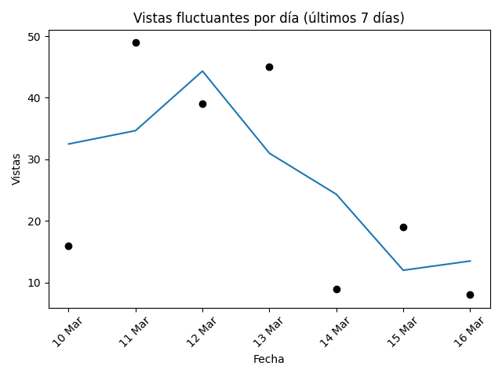
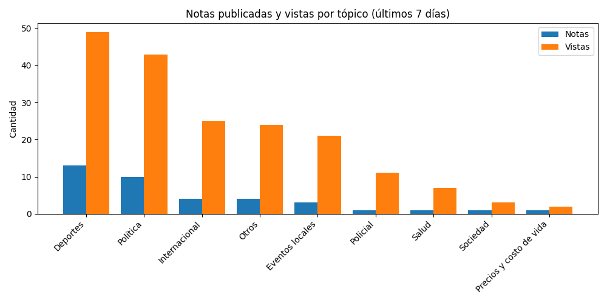
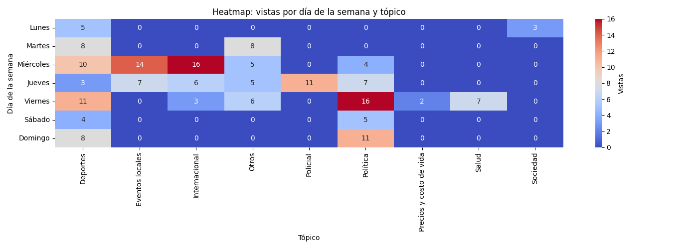

# Newsletter semanal (2026-03-16)

**Total de artículos (09 Mar – 16 Mar):** 38  

**Tópicos cubiertos:** 9

---

## 📈 Vistas fluctuantes por día

---

## 📑 Notas publicadas vs vistas por tópico

---

## 🗓️ Vistas por día y tópico

---

## 🔝 Tópicos más frecuentes

| Tópico | Notas | % Total | Vistas | Vistas/Nota |
|---|---:|---:|---:|---:|
| Deportes | 13 | 34% | 49 | 3.8 |
| Política | 10 | 26% | 43 | 4.3 |
| Internacional | 4 | 11% | 25 | 6.2 |
| Otros | 4 | 11% | 24 | 6.0 |
| Eventos locales | 3 | 8% | 21 | 7.0 |
| Sociedad | 1 | 3% | 3 | 3.0 |
| Salud | 1 | 3% | 7 | 7.0 |
| Precios y costo de vida | 1 | 3% | 2 | 2.0 |

---

## ✨ Artículos destacados

### Tragedia en Santa Rosa de Calamuchita: un vecino murió tras intentar detener a un ladrón
*12 Mar 2026 — 11 vistas*

### El petróleo vuelve a subir, mientras el mercado sigue con incertidumbre la guerra en Medio Oriente
*11 Mar 2026 — 9 vistas*

### El Lago de Embalse se vistió de gala para el Oceanman Argentina 2026
*10 Mar 2026 — 8 vistas*

### Villa Ciudad Parque: se puso en marcha la ampliación de la red troncal de gas natural
*10 Mar 2026 — 8 vistas*

---

## 🔮 Recomendaciones

- Refuerzo en **Policial**: alto interés con pocas notas (engagement: 11.0).
- Optimizar **Deportes**: bajo interés relativo pese a varias notas (engagement: 3.8).
- Buen rendimiento en **Eventos locales**: mantener estrategia (engagement: 7.0).

## ✍️ Autores de la semana

- Francis Dinatale
- Jose Manuel Ferrero